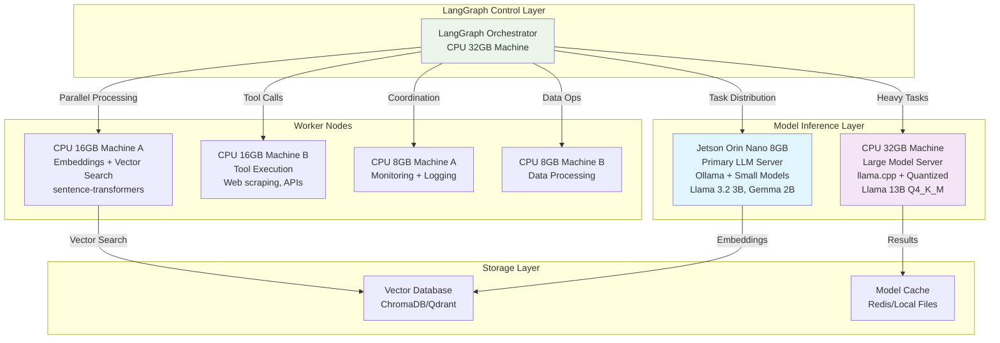
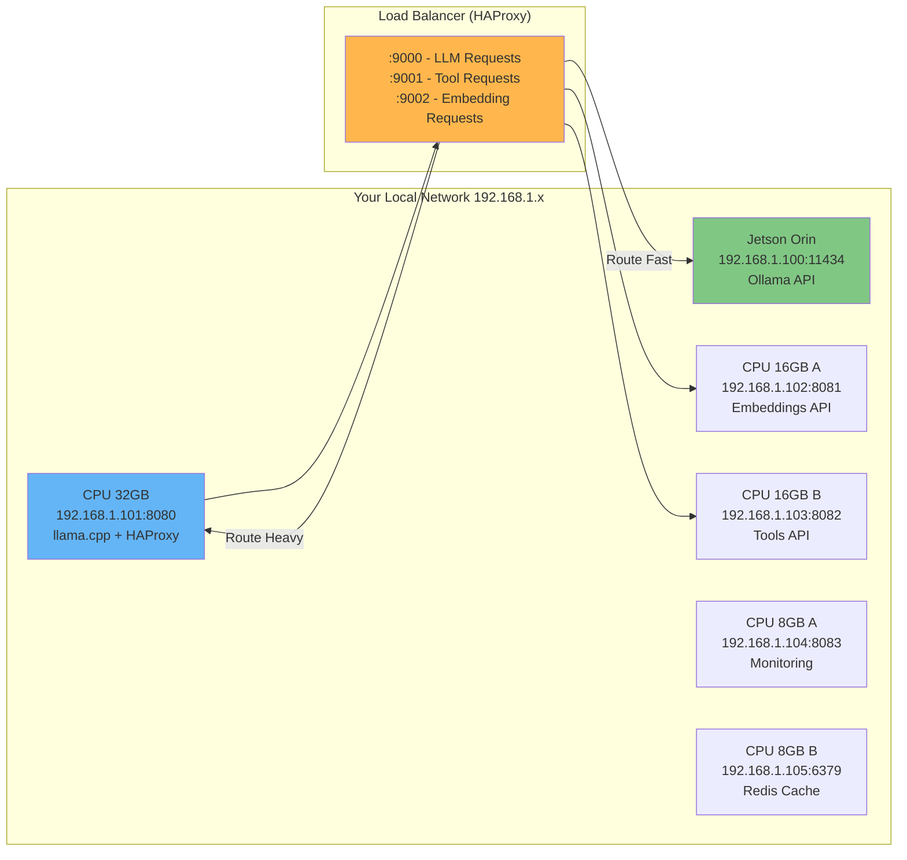
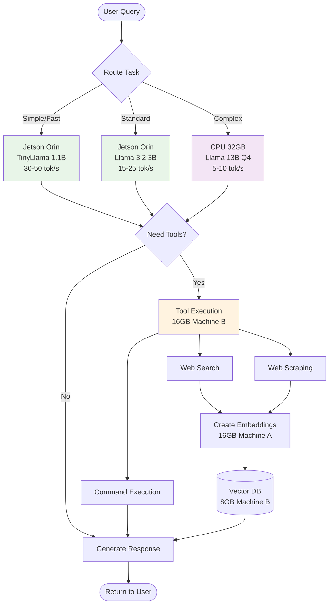
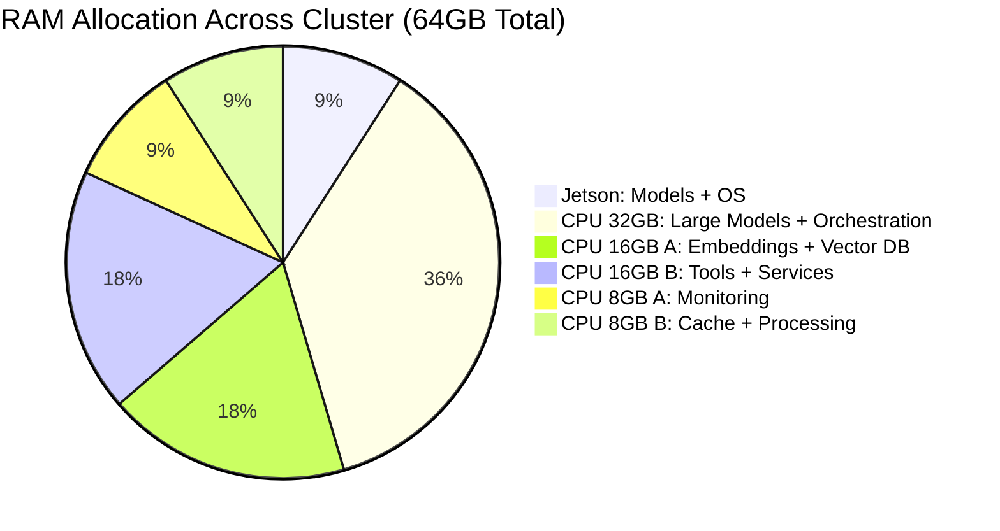
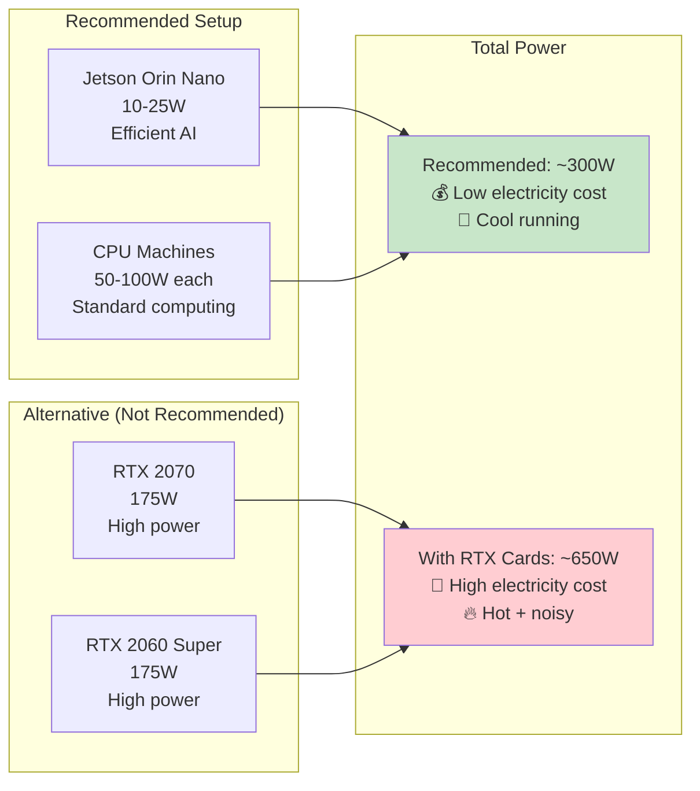
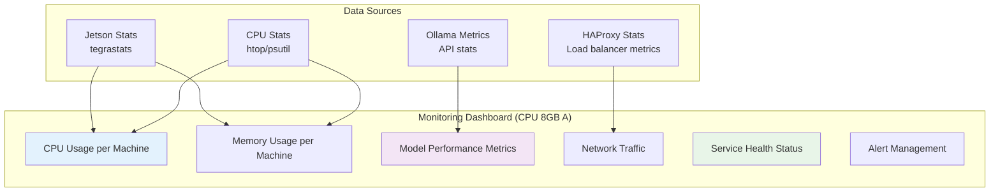

# LangGraph Local AI Architecture Diagrams

## Main Cluster Architecture

This diagram shows how your hardware is organized for optimal AI workloads:



## Network Architecture

Shows how machines communicate:



## LangGraph Workflow Flow

Shows how tasks flow through your system:



## Resource Allocation

Shows how your 64GB total RAM is distributed:



## Power Consumption Comparison

Why we skip RTX cards:



## Development Workflow

Your learning journey with this setup:

```mermaid
timeline
    title Learning Path with Local AI Setup
    
    section Week 1 : Setup Phase
        Day 1-2    : Configure Jetson Orin
                   : Install Ollama + models
        Day 3-4    : Setup CPU machines
                   : Configure llama.cpp
        Day 5-7    : LangGraph integration
                   : Test basic workflows
    
    section Week 2-4 : Learning Phase
        Week 2     : Basic LangGraph patterns
                   : Simple agent workflows
        Week 3     : Complex multi-agent systems
                   : Tool integration
        Week 4     : Custom workflows
                   : Performance optimization
    
    section Month 2+ : Advanced
        Advanced   : Custom model fine-tuning
                   : Distributed optimization
                   : Production deployment
```

## Monitoring Dashboard Layout

What your monitoring will show:



---

## Quick Reference

| Component | IP Address | Port | Purpose |
|-----------|------------|------|---------|
| Jetson Orin | 192.168.1.100 | 11434 | Primary LLM (Ollama) |
| CPU 32GB | 192.168.1.101 | 8080, 9000 | Heavy LLM + Load Balancer |
| CPU 16GB A | 192.168.1.102 | 8081 | Embeddings Server |
| CPU 16GB B | 192.168.1.103 | 8082 | Tools Server |
| CPU 8GB A | 192.168.1.104 | 8083 | Monitoring |
| CPU 8GB B | 192.168.1.105 | 6379 | Redis Cache |

**Load Balanced Endpoints:**
- LLM: `http://192.168.1.101:9000`
- Tools: `http://192.168.1.101:9001`  
- Embeddings: `http://192.168.1.101:9002`
