# LangGraph Local AI Architecture Diagrams

## Main Cluster Architecture

This diagram shows how your hardware is organized for optimal AI workloads:

## Network Architecture

Shows how machines communicate:

## LangGraph Workflow Flow

Shows how tasks flow through your system:

## Resource Allocation

Shows how your 64GB total RAM is distributed:

## Power Consumption Comparison

Why we skip RTX cards:

```mermaid
graph LR
    subgraph "Recommended Setup"
        J[Jetson Orin Nano<br/>10-25W<br/>Efficient AI]
        C[CPU Machines<br/>50-100W each<br/>Standard computing]
    end
    
    subgraph "Alternative (Not Recommended)"
        R1[RTX 2070<br/>175W<br/>High power]
        R2[RTX 2060 Super<br/>175W<br/>High power]
    end
    
    subgraph "Total Power"
        REC[Recommended: ~300W<br/>💰 Low electricity cost<br/>🌱 Cool running]
        ALT[With RTX Cards: ~650W<br/>💸 High electricity cost<br/>🔥 Hot + noisy]
    end
    
    J --> REC
    C --> REC
    R1 --> ALT
    R2 --> ALT
    
    style REC fill:#c8e6c9
    style ALT fill:#ffcdd2
```

## Development Workflow

Your learning journey with this setup:

### 📅 Learning Timeline

**🚀 Week 1: Setup Phase**
- **Day 1-2**: Configure Jetson Orin
  - Install Ollama + models (llama3.2:3b, llama3.2:1b)
  - Test basic inference
- **Day 3-4**: Setup CPU machines  
  - Configure Ollama + HAProxy + Redis
  - Test load balancing
- **Day 5-7**: LangGraph integration
  - Set up intelligent routing
  - Test basic workflows

**🧠 Week 2-4: Learning Phase** 
- **Week 2**: Basic LangGraph patterns
  - Simple agent workflows
  - State management
- **Week 3**: Complex multi-agent systems
  - Tool integration (web search, scraping)
  - Multi-step workflows
- **Week 4**: Custom workflows  
  - Performance optimization
  - Advanced routing strategies

**🎯 Month 2+: Advanced Phase**
- Custom model experiments
- Distributed optimization
- Production-ready deployments

### 📊 Progress Tracking

Monitor your progress with:
- HAProxy stats: `http://cpu-node:9000/haproxy_stats`  
- System monitoring: `htop` on each machine
- LangGraph workflow logs
- Model performance metrics

## Monitoring Dashboard Layout

What your monitoring will show:

---

## Quick Reference

| Component | Hostname | IP Address | Port | Purpose |
|-----------|----------|------------|------|---------|
| Jetson Orin Nano | jetson-node | 192.168.1.177 | 11434 | Primary LLM (Ollama) |
| CPU 32GB Coordinator | cpu-node | 192.168.1.81 | 8080, 9000, 6379 | Heavy LLM + Load Balancer + Redis |
| ARM 8GB | rp-node | 192.168.1.178 | 8081 | Embeddings Server |
| VM 6GB Tools | worker-node3 | 192.168.1.190 | 8082 | Tools Server |
| VM 6GB Monitor | worker-node4 | 192.168.1.191 | 8083 | Monitoring |

**Load Balanced Endpoints:**
- LLM: `http://192.168.1.81:9000`
- Tools: `http://192.168.1.81:9001`  
- Embeddings: `http://192.168.1.81:9002`

**Available Nodes Status:**
- ✅ jetson-node (192.168.1.177) - Jetson Orin Nano 8GB
- ✅ cpu-node (192.168.1.81) - 32GB RAM Intel i5-6500T
- ✅ rp-node (192.168.1.178) - 8GB ARM Cortex-A76
- ✅ worker-node3 (192.168.1.190) - 6GB VM
- ✅ worker-node4 (192.168.1.191) - 6GB VM
- ❌ cpu-node1, cpu-node2 - Currently unavailable
- ❌ gpu-node, gpu-node1 - Currently unavailable
