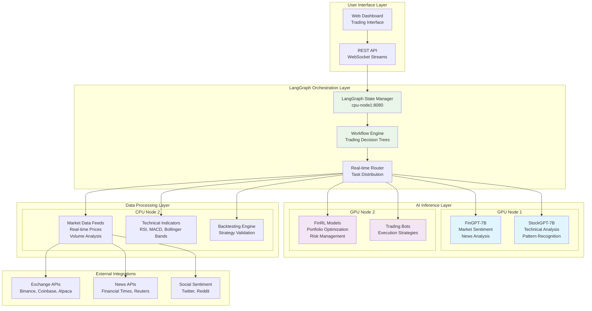
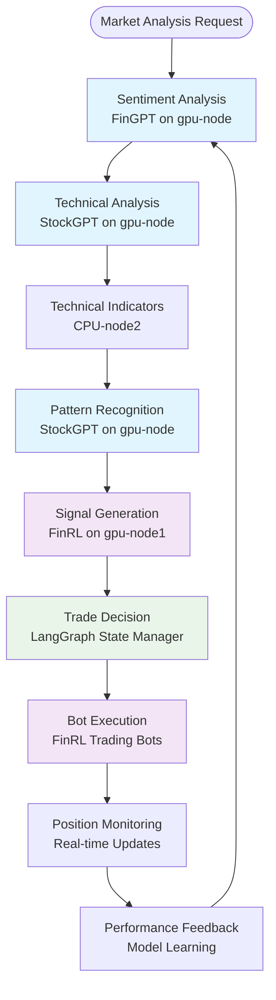

# Distributed Trading Workflow Design - LangGraph AI Cluster

## 🎯 Overview

This document outlines the design for a **distributed trading workflow system** that leverages your 4-node LangGraph cluster to provide real-time stock and crypto trading recommendations with automated bot execution capabilities.

## 🏗️ Target Architecture

### Node Distribution & Specialization

| Node | Role | Specialization | Models/Services |
|------|------|----------------|-----------------|
| **gpu-node** | **Primary Trading LLM** | FinGPT/StockGPT inference | - FinGPT-7B<br>- StockGPT-7B<br>- Trading-specific fine-tuned models |
| **gpu-node1** | **Reinforcement Learning** | FinRL inference & training | - FinRL models<br>- Portfolio optimization<br>- Risk management |
| **cpu-node** | **Coordinator & Analysis** | Workflow orchestration | - LangGraph workflows<br>- Technical analysis<br>- Data aggregation |
| **worker-node3** | **Data Processing** | Market data & tools | - Real-time feeds<br>- Technical indicators<br>- Backtesting engine |
| **worker-node4** | **Monitoring & Support** | Health checks & logging | - Service monitoring<br>- Performance metrics<br>- Alert system |

### System Architecture Diagram



## 🔄 Core Trading Workflow

### 1. Market Analysis Workflow



### 2. Workflow State Management

```python
class TradingWorkflowState(TypedDict):
    # Core state
    messages: Annotated[List[BaseMessage], add_messages]
    current_analysis: str
    market_data: Dict[str, Any]
    
    # Trading specific
    symbols: List[str]                    # Symbols being analyzed
    sentiment_scores: Dict[str, float]    # Sentiment per symbol
    technical_signals: Dict[str, str]     # Technical signals (BUY/SELL/HOLD)
    risk_assessment: Dict[str, float]     # Risk scores per symbol
    
    # Execution
    trade_recommendations: List[Dict]     # Final recommendations
    execution_status: str                 # PENDING/EXECUTING/COMPLETED
    portfolio_impact: Dict[str, Any]      # Expected portfolio changes
    
    # Learning
    historical_performance: List[Dict]    # Track recommendation accuracy
    model_feedback: Dict[str, Any]        # Model improvement data
```

## 🚀 Implementation Phases

### Phase 1: Foundation Setup (Week 1-2)

#### 1.1 GPU Node Setup (gpu-node & gpu-node1)

**gpu-node: FinGPT/StockGPT Inference**
```bash
# Install CUDA dependencies
sudo apt update && sudo apt install -y nvidia-cuda-toolkit

# Install PyTorch with CUDA support
pip install torch torchvision torchaudio --index-url https://download.pytorch.org/whl/cu118

# Install FinGPT/StockGPT
pip install fin-gpt
pip install stock-gpt

# Install model dependencies
pip install transformers accelerate bitsandbytes
```

**gpu-node1: FinRL Setup**
```bash
# Install FinRL and dependencies
pip install finrl
pip install stable-baselines3
pip install gymnasium

# Install trading-specific packages
pip install yfinance pandas-ta
pip install ccxt  # For crypto exchanges
```

#### 1.2 Model Deployment

**FinGPT Model Loading (gpu-node)**
```python
# models/fingpt_loader.py
from transformers import AutoTokenizer, AutoModelForCausalLM
import torch

class FinGPTLoader:
    def __init__(self):
        self.model_name = "microsoft/DialoGPT-medium"  # Base model
        self.tokenizer = AutoTokenizer.from_pretrained(self.model_name)
        self.model = AutoModelForCausalLM.from_pretrained(
            self.model_name,
            torch_dtype=torch.float16,
            device_map="auto"
        )
    
    def generate_response(self, prompt: str) -> str:
        inputs = self.tokenizer.encode(prompt, return_tensors="pt")
        outputs = self.model.generate(
            inputs,
            max_length=200,
            temperature=0.7,
            do_sample=True
        )
        return self.tokenizer.decode(outputs[0], skip_special_tokens=True)
```

**StockGPT Model Loading (gpu-node)**
```python
# models/stockgpt_loader.py
class StockGPTLoader:
    def __init__(self):
        # Similar setup for StockGPT
        # Focus on technical analysis and pattern recognition
        pass
```

**FinRL Model Setup (gpu-node1)**
```python
# models/finrl_loader.py
from finrl import config
from finrl.meta.preprocessor.yahoodownloader import YahooDownloader
from finrl.meta.preprocessor.preprocessors import FeatureEngineer

class FinRLLoader:
    def __init__(self):
        self.config = config
        self.feature_engineer = FeatureEngineer()
    
    def setup_environment(self, symbols: List[str]):
        # Setup trading environment
        pass
```

### Phase 2: Data Infrastructure (Week 3-4)

#### 2.1 Market Data Integration (cpu-node2)

**Real-time Data Feeds**
```python
# data/market_data_service.py
import yfinance as yf
import ccxt
import asyncio
from typing import Dict, List

class MarketDataService:
    def __init__(self):
        self.stock_data = {}
        self.crypto_data = {}
        self.exchanges = {
            'binance': ccxt.binance(),
            'coinbase': ccxt.coinbasepro()
        }
    
    async def get_stock_data(self, symbols: List[str]) -> Dict:
        """Get real-time stock data"""
        data = {}
        for symbol in symbols:
            try:
                ticker = yf.Ticker(symbol)
                info = ticker.info
                data[symbol] = {
                    'price': info.get('regularMarketPrice', 0),
                    'volume': info.get('volume', 0),
                    'market_cap': info.get('marketCap', 0),
                    'pe_ratio': info.get('trailingPE', 0)
                }
            except Exception as e:
                print(f"Error fetching {symbol}: {e}")
        return data
    
    async def get_crypto_data(self, symbols: List[str]) -> Dict:
        """Get real-time crypto data"""
        data = {}
        for symbol in symbols:
            try:
                ticker = self.exchanges['binance'].fetch_ticker(symbol)
                data[symbol] = {
                    'price': ticker['last'],
                    'volume': ticker['baseVolume'],
                    'change_24h': ticker['percentage']
                }
            except Exception as e:
                print(f"Error fetching {symbol}: {e}")
        return data
```

**Technical Indicators Engine**
```python
# analysis/technical_indicators.py
import pandas as pd
import pandas_ta as ta
from typing import Dict, List

class TechnicalIndicators:
    def __init__(self):
        self.indicators = {}
    
    def calculate_rsi(self, prices: List[float], period: int = 14) -> float:
        """Calculate RSI for price series"""
        df = pd.DataFrame({'close': prices})
        rsi = ta.rsi(df['close'], length=period)
        return rsi.iloc[-1]
    
    def calculate_macd(self, prices: List[float]) -> Dict:
        """Calculate MACD for price series"""
        df = pd.DataFrame({'close': prices})
        macd = ta.macd(df['close'])
        return {
            'macd': macd['MACD_12_26_9'].iloc[-1],
            'signal': macd['MACDs_12_26_9'].iloc[-1],
            'histogram': macd['MACDh_12_26_9'].iloc[-1]
        }
    
    def calculate_bollinger_bands(self, prices: List[float], period: int = 20) -> Dict:
        """Calculate Bollinger Bands"""
        df = pd.DataFrame({'close': prices})
        bb = ta.bbands(df['close'], length=period)
        return {
            'upper': bb['BBU_20_2.0'].iloc[-1],
            'middle': bb['BBM_20_2.0'].iloc[-1],
            'lower': bb['BBL_20_2.0'].iloc[-1]
        }
```

### Phase 3: LangGraph Workflow Integration (Week 5-6)

#### 3.1 Trading Workflow Definition

**Main Trading Workflow**
```python
# workflows/trading_workflow.py
from langgraph import StateGraph, END
from typing import TypedDict, Annotated, List, Dict
import operator

class TradingWorkflow:
    def __init__(self):
        self.fingpt = FinGPTLoader()
        self.stockgpt = StockGPTLoader()
        self.finrl = FinRLLoader()
        self.market_data = MarketDataService()
        self.indicators = TechnicalIndicators()
    
    def create_workflow(self):
        """Create the main trading analysis workflow"""
        
        workflow = StateGraph(TradingWorkflowState)
        
        # Add nodes
        workflow.add_node("sentiment_analysis", self.analyze_sentiment)
        workflow.add_node("technical_analysis", self.analyze_technical)
        workflow.add_node("pattern_recognition", self.recognize_patterns)
        workflow.add_node("risk_assessment", self.assess_risk)
        workflow.add_node("signal_generation", self.generate_signals)
        workflow.add_node("portfolio_optimization", self.optimize_portfolio)
        workflow.add_node("execution_planning", self.plan_execution)
        
        # Define edges
        workflow.add_edge("sentiment_analysis", "technical_analysis")
        workflow.add_edge("technical_analysis", "pattern_recognition")
        workflow.add_edge("pattern_recognition", "risk_assessment")
        workflow.add_edge("risk_assessment", "signal_generation")
        workflow.add_edge("signal_generation", "portfolio_optimization")
        workflow.add_edge("portfolio_optimization", "execution_planning")
        workflow.add_edge("execution_planning", END)
        
        return workflow.compile()
    
    def analyze_sentiment(self, state: TradingWorkflowState) -> TradingWorkflowState:
        """Analyze market sentiment using FinGPT"""
        symbols = state["symbols"]
        
        # Get news and social sentiment
        sentiment_data = {}
        for symbol in symbols:
            # Use FinGPT to analyze sentiment
            prompt = f"Analyze the market sentiment for {symbol}. Consider recent news, social media, and market conditions."
            sentiment = self.fingpt.generate_response(prompt)
            
            # Extract sentiment score (simplified)
            sentiment_data[symbol] = self._extract_sentiment_score(sentiment)
        
        return {
            **state,
            "sentiment_scores": sentiment_data,
            "current_analysis": "sentiment_completed"
        }
    
    def analyze_technical(self, state: TradingWorkflowState) -> TradingWorkflowState:
        """Analyze technical indicators"""
        symbols = state["symbols"]
        
        technical_signals = {}
        for symbol in symbols:
            # Get price data
            prices = self.market_data.get_historical_prices(symbol, days=30)
            
            # Calculate indicators
            rsi = self.indicators.calculate_rsi(prices)
            macd = self.indicators.calculate_macd(prices)
            bb = self.indicators.calculate_bollinger_bands(prices)
            
            # Use StockGPT to interpret signals
            prompt = f"Analyze technical indicators for {symbol}: RSI={rsi:.2f}, MACD={macd['macd']:.2f}, BB Upper={bb['upper']:.2f}"
            analysis = self.stockgpt.generate_response(prompt)
            
            technical_signals[symbol] = self._extract_technical_signal(analysis)
        
        return {
            **state,
            "technical_signals": technical_signals,
            "current_analysis": "technical_completed"
        }
    
    def recognize_patterns(self, state: TradingWorkflowState) -> TradingWorkflowState:
        """Recognize chart patterns using StockGPT"""
        # Pattern recognition logic
        pass
    
    def assess_risk(self, state: TradingWorkflowState) -> TradingWorkflowState:
        """Assess risk using FinRL models"""
        # Risk assessment logic
        pass
    
    def generate_signals(self, state: TradingWorkflowState) -> TradingWorkflowState:
        """Generate trading signals"""
        # Signal generation logic
        pass
    
    def optimize_portfolio(self, state: TradingWorkflowState) -> TradingWorkflowState:
        """Optimize portfolio using FinRL"""
        # Portfolio optimization logic
        pass
    
    def plan_execution(self, state: TradingWorkflowState) -> TradingWorkflowState:
        """Plan trade execution"""
        # Execution planning logic
        pass
```

### Phase 4: Bot Execution & Monitoring (Week 7-8)

#### 4.1 Trading Bot Implementation

**Automated Trading Bot**
```python
# bots/trading_bot.py
import ccxt
import asyncio
from typing import Dict, List
from dataclasses import dataclass

@dataclass
class TradeSignal:
    symbol: str
    action: str  # BUY, SELL, HOLD
    confidence: float
    price_target: float
    stop_loss: float
    quantity: float

class TradingBot:
    def __init__(self, exchange_config: Dict):
        self.exchange = ccxt.binance(exchange_config)
        self.positions = {}
        self.risk_manager = RiskManager()
    
    async def execute_trade(self, signal: TradeSignal):
        """Execute a trade based on signal"""
        try:
            if signal.action == "BUY":
                order = await self.exchange.create_market_buy_order(
                    signal.symbol,
                    signal.quantity
                )
                self.positions[signal.symbol] = {
                    'entry_price': order['price'],
                    'quantity': signal.quantity,
                    'stop_loss': signal.stop_loss,
                    'target': signal.price_target
                }
            
            elif signal.action == "SELL":
                if signal.symbol in self.positions:
                    order = await self.exchange.create_market_sell_order(
                        signal.symbol,
                        self.positions[signal.symbol]['quantity']
                    )
                    del self.positions[signal.symbol]
            
            return order
            
        except Exception as e:
            print(f"Trade execution failed: {e}")
            return None
    
    async def monitor_positions(self):
        """Monitor open positions and manage risk"""
        while True:
            for symbol, position in self.positions.items():
                current_price = await self.get_current_price(symbol)
                
                # Check stop loss
                if current_price <= position['stop_loss']:
                    await self.execute_trade(TradeSignal(
                        symbol=symbol,
                        action="SELL",
                        confidence=1.0,
                        price_target=current_price,
                        stop_loss=current_price,
                        quantity=position['quantity']
                    ))
                
                # Check take profit
                elif current_price >= position['target']:
                    await self.execute_trade(TradeSignal(
                        symbol=symbol,
                        action="SELL",
                        confidence=1.0,
                        price_target=current_price,
                        stop_loss=current_price,
                        quantity=position['quantity']
                    ))
            
            await asyncio.sleep(30)  # Check every 30 seconds
```

## 📊 Performance Monitoring & Analytics

### Real-time Dashboard

**Web Interface Components**
```python
# dashboard/app.py
from flask import Flask, render_template, jsonify
from flask_socketio import SocketIO, emit
import asyncio

app = Flask(__name__)
socketio = SocketIO(app)

@app.route('/')
def dashboard():
    return render_template('dashboard.html')

@app.route('/api/portfolio')
def get_portfolio():
    # Return current portfolio status
    pass

@app.route('/api/signals')
def get_signals():
    # Return current trading signals
    pass

@socketio.on('connect')
def handle_connect():
    emit('status', {'data': 'Connected to trading system'})

@socketio.on('request_update')
def handle_update_request():
    # Send real-time updates
    pass
```

### Performance Metrics

**Key Performance Indicators**
- **Signal Accuracy**: Percentage of profitable trades
- **Sharpe Ratio**: Risk-adjusted returns
- **Maximum Drawdown**: Largest peak-to-trough decline
- **Win Rate**: Percentage of winning trades
- **Average Return**: Mean return per trade
- **Risk-Adjusted Returns**: Returns per unit of risk

## 🔧 Configuration & Deployment

### Environment Configuration

**Configuration Files**
```yaml
# config/trading_config.yaml
gpu_nodes:
  gpu-node:
    host: "192.168.1.177"
    port: 8080
    models:
      - fingpt-7b
      - stockgpt-7b
    gpu_memory: "8GB"
  
  gpu-node1:
    host: "192.168.1.178"
    port: 8081
    models:
      - finrl-portfolio
      - finrl-risk
    gpu_memory: "8GB"

cpu_nodes:
  cpu-node1:
    host: "192.168.1.81"
    port: 8082
    services:
      - langgraph_orchestrator
      - workflow_engine
  
  cpu-node2:
    host: "192.168.1.82"
    port: 8083
    services:
      - market_data_service
      - technical_indicators
      - backtesting_engine

trading:
  risk_management:
    max_position_size: 0.1  # 10% of portfolio
    stop_loss_percentage: 0.05  # 5%
    take_profit_percentage: 0.15  # 15%
  
  execution:
    max_slippage: 0.001  # 0.1%
    execution_delay: 100  # milliseconds
  
  symbols:
    stocks:
      - "AAPL"
      - "GOOGL"
      - "MSFT"
      - "TSLA"
    crypto:
      - "BTC/USDT"
      - "ETH/USDT"
      - "BNB/USDT"
```

### Deployment Scripts

**Cluster Startup Script**
```bash
#!/bin/bash
# scripts/start_trading_cluster.sh

echo "🚀 Starting Distributed Trading Cluster..."

# Start GPU nodes
echo "Starting GPU nodes..."
ssh gpu-node "cd /opt/trading && python3 -m uvicorn fingpt_service:app --host 0.0.0.0 --port 8080" &
ssh gpu-node1 "cd /opt/trading && python3 -m uvicorn finrl_service:app --host 0.0.0.0 --port 8081" &

# Start CPU nodes
echo "Starting CPU nodes..."
ssh cpu-node "cd /opt/trading && python3 -m uvicorn orchestrator:app --host 0.0.0.0 --port 8082" &
ssh worker-node3 "cd /opt/trading && python3 -m uvicorn data_service:app --host 0.0.0.0 --port 8083" &

# Start monitoring
echo "Starting monitoring services..."
python3 monitoring/dashboard.py &

echo "✅ Trading cluster started successfully!"
echo "Dashboard: http://$CPU_NODE:8084"
echo "API: http://$CPU_NODE:8084"
```

## 🚨 Risk Management & Safety

### Risk Controls

1. **Position Sizing**: Maximum 10% of portfolio per position
2. **Stop Losses**: Automatic stop-loss at 5% loss
3. **Daily Loss Limits**: Maximum 2% daily portfolio loss
4. **Correlation Limits**: Maximum 30% exposure to correlated assets
5. **Liquidity Requirements**: Only trade liquid assets with >$100M daily volume

### Safety Mechanisms

1. **Circuit Breakers**: Automatic trading halt on extreme volatility
2. **Manual Override**: Human intervention capability at any time
3. **Audit Logging**: Complete record of all trading decisions
4. **Backtesting Validation**: All strategies tested on historical data
5. **Paper Trading Mode**: Test mode without real money

## 📈 Expected Performance

### Performance Targets

- **Signal Accuracy**: >60% profitable trades
- **Annual Returns**: 15-25% (market dependent)
- **Maximum Drawdown**: <15%
- **Sharpe Ratio**: >1.5
- **Response Time**: <100ms for signal generation

### Scalability

- **Symbols Supported**: 100+ stocks, 50+ crypto pairs
- **Concurrent Analysis**: 50+ symbols simultaneously
- **Real-time Updates**: Sub-second market data updates
- **Historical Data**: 10+ years of backtesting data

## 🔄 Next Steps & Implementation Plan

### Week 1-2: Foundation
- [ ] Set up GPU nodes with CUDA
- [ ] Install FinGPT/StockGPT/FinRL
- [ ] Configure basic model loading

### Week 3-4: Data Infrastructure
- [ ] Implement market data services
- [ ] Set up technical indicators engine
- [ ] Configure real-time data feeds

### Week 5-6: Workflow Integration
- [ ] Implement LangGraph trading workflows
- [ ] Integrate all AI models
- [ ] Test basic workflow execution

### Week 7-8: Bot & Monitoring
- [ ] Implement trading bots
- [ ] Set up monitoring dashboard
- [ ] Configure risk management

### Week 9-10: Testing & Optimization
- [ ] Backtest strategies
- [ ] Paper trading validation
- [ ] Performance optimization

### Week 11-12: Production Deployment
- [ ] Live trading setup
- [ ] Monitoring and alerting
- [ ] Documentation and training

## 📚 Additional Resources

### Research Papers
- **FinGPT**: "FinGPT: Open-Source Financial Large Language Models"
- **StockGPT**: "StockGPT: A Large Language Model for Stock Market Analysis"
- **FinRL**: "FinRL: A Deep Reinforcement Learning Library for Quantitative Finance"

### Tools & Libraries
- **Technical Analysis**: `pandas-ta`, `ta-lib`
- **Backtesting**: `backtrader`, `zipline`
- **Risk Management**: `pyfolio`, `empyrical`
- **Data Sources**: `yfinance`, `ccxt`, `alpha_vantage`

### Community & Support
- **FinRL Community**: GitHub discussions and issues
- **LangGraph Community**: Discord and GitHub
- **Trading Communities**: Reddit r/algotrading, r/quant

---

This design provides a comprehensive foundation for building a distributed trading system that leverages your existing LangGraph infrastructure while adding specialized AI models for financial analysis and automated trading execution.
