# LangGraph Concepts and Distributed Workflows

## 🧠 Understanding LangGraph

**LangGraph** is a state machine framework for building complex AI workflows. It orchestrates multiple LLMs, tools, and services in your distributed setup.

## 📊 LangGraph Workflow Architecture


### Core Concepts

#### 1. State Management
```python
class AgentState(TypedDict):
    messages: Annotated[List[BaseMessage], add_messages]
    current_model: str           # Which LLM is being used
    task_complexity: str         # simple/standard/complex
    tools_used: List[str]        # Track tool usage
    context: str                 # Additional context from tools
    results: Dict[str, Any]      # Store intermediate results
```

**What this means:** LangGraph maintains conversation state across your entire distributed system. Each request carries context about what happened before.

## 🔄 State Flow and Configuration Integration


#### 2. Node Functions
Each node is a function that takes state and returns updated state:

```python
def simple_response_node(state: AgentState) -> AgentState:
    # Uses Jetson Ollama (fast response)
    response = jetson_fast.invoke(state["messages"][-1].content)
    return {
        **state,
        "messages": state["messages"] + [AIMessage(content=response)],
        "current_model": "jetson_tinyllama",
        "task_complexity": "simple"
    }
```

**What this means:** Each node processes the request and updates the conversation state with new information.

#### 3. Routing Logic
The router decides which service to use:

```python
def route_request(state: AgentState) -> str:
    message = state["messages"][-1].content.lower()
    
    if "search" in message: return "needs_search"      # → Tools Node (192.168.1.105:8082)
    elif len(message) > 200: return "complex_task"      # → CPU Ollama (192.168.1.81:11435)  
    else: return "simple_task"                          # → Jetson Ollama (192.168.1.177:11434)
```

**What this means:** LangGraph automatically routes requests to the best service in your cluster based on content analysis.

## 🏗️ How LangGraph Uses Your Configuration

## 🎯 LangGraph Implementation Architecture

```mermaid
graph TD
    subgraph "LangGraph Core Concepts"
        A[Graph Definition] --> B[State Schema]
        B --> C[Node Functions]
        C --> D[Edge Conditions]
        D --> E[Workflow Execution]
    end
    
    subgraph "Your Implementation"
        F[AgentState Schema<br/>• messages<br/>• current_model<br/>• task_complexity<br/>• tools_used<br/>• context<br/>• results]
        
        G[Router Function<br/>route_request&#40;state&#41;<br/>• Analyzes message<br/>• Checks keywords<br/>• Determines complexity<br/>• Returns next node]
        
        H[Processing Nodes<br/>• simple_response_node<br/>• standard_response_node<br/>• complex_response_node<br/>• search_and_respond_node<br/>• scrape_and_respond_node<br/>• command_and_respond_node]
        
        I[Service Integration<br/>• JetsonOllamaLLM<br/>• CPULlamaLLM<br/>• LoadBalancedLLM<br/>• WebSearchTool<br/>• WebScrapeTool<br/>• CommandExecuteTool]
    end
    
    subgraph "Configuration Bridge"
        J[CLUSTER Config<br/>Maps to → Service URLs]
        K[ENDPOINTS Config<br/>Maps to → HAProxy Load Balancing]
        L[LLM Classes<br/>Use → CLUSTER IPs/Ports]
        M[Tool Classes<br/>Use → Worker Node URLs]
    end
    
    B --> F
    C --> G
    C --> H
    E --> I
    
    I --> J
    I --> K
    I --> L
    I --> M
    
    style A fill:#e3f2fd
    style F fill:#f3e5f5
    style G fill:#fff3e0
    style H fill:#e8f5e8
    style I fill:#fce4ec
    style J fill:#ffebee
    style K fill:#f1f8e9
    style L fill:#fff8e1
    style M fill:#e0f2f1
```



### Configuration → Service Mapping

```python
# Your CLUSTER config maps directly to LangGraph services:
CLUSTER = ClusterConfig(
    jetson_orin=MachineConfig(ip="192.168.1.177", port=11434, ...)  # → JetsonOllamaLLM
    cpu_coordinator=MachineConfig(ip="192.168.1.81", port=11435, ...)  # → CPULlamaLLM
    worker_tools=MachineConfig(ip="192.168.1.105", port=8082, ...)     # → WebSearchTool
)
```

### Service Integration Example

```python
class JetsonOllamaLLM(LLM):
    jetson_url: str = "http://192.168.1.177:11434"  # ← Uses CLUSTER.jetson_orin.ip:port
    
    def _call(self, prompt: str) -> str:
        response = requests.post(f"{self.jetson_url}/api/generate", {...})
        return response.json()["response"]
```

**What this means:** Your configuration files directly control which physical machines LangGraph uses for each task.

## 🔄 Workflow Examples

## 🔄 Two Routing Strategies: Intelligent vs Load Balanced

**Important:** Your setup supports two different routing approaches:

```mermaid
graph TD
    A[User Request] --> B[LangGraph Router]
    
    B --> C{Routing Strategy}
    
    subgraph "INTELLIGENT ROUTING (Task-based)"
        C -->|Simple Task| D[simple_response_node]
        C -->|Complex Task| E[complex_response_node]
        C -->|Tool Task| F[search_and_respond_node]
        
        D --> G[JetsonOllamaLLM]
        E --> H[CPULlamaLLM]  
        F --> I[WebSearchTool + JetsonOllamaLLM]
        
        G -.->|DIRECT| J[Jetson: 192.168.1.177:11434]
        H -.->|DIRECT| K[CPU: 192.168.1.81:11435]
        I -.->|DIRECT| L[Tools: 192.168.1.105:8082]
        I -.->|DIRECT| J
    end
    
    subgraph "LOAD BALANCED ROUTING (HAProxy)"
        C -->|Any Task| M[response_node]
        M --> N[LoadBalancedLLM]
        N --> O[HAProxy: 192.168.1.81:9000]
        O -->|67% Weight| J
        O -->|33% Weight| K
    end
    
    subgraph "When to Use Each"
        P["INTELLIGENT ROUTING:<br/>• Learning & experimentation<br/>• Optimize for task type<br/>• Different models for different needs<br/>• Fine-grained control"]
        
        Q["LOAD BALANCED ROUTING:<br/>• Production simplicity<br/>• High availability<br/>• Even resource utilization<br/>• Failover capability"]
    end
    
    style A fill:#e1f5fe
    style B fill:#f3e5f5
    style C fill:#fff3e0
    style G fill:#e8f5e8
    style H fill:#ffcdd2
    style N fill:#fff9c4
    style O fill:#e0f2f1
    style P fill:#f3e5f5
    style Q fill:#fff3e0
```



### **Key Insight**: HAProxy and LangGraph serve different routing purposes!

- **LangGraph Intelligent Routing**: Routes based on task analysis (simple/complex/tools)
- **HAProxy Load Balancing**: Routes based on server load and availability

### Example 1: Intelligent Routing - Simple Question
```
User: "What's 2+2?"
│
├─ LangGraph Router: Analyzes "simple math"
├─ Routes to: simple_response_node 
├─ Uses: JetsonOllamaLLM → DIRECT to 192.168.1.177:11434
├─ Model: llama3.2:1b (fast, efficient)
├─ Response: "2+2 equals 4"
└─ State Updated: current_model="jetson_tinyllama", task_complexity="simple"
```

### Example 2: Intelligent Routing - Complex Research
```
User: "Research the latest AI developments and write a comprehensive analysis"
│
├─ LangGraph Router: Detects "research" + long message
├─ Routes to: search_and_respond_node
├─ Step 1: WebSearchTool → DIRECT to 192.168.1.105:8082 → Search results
├─ Step 2: complex_response_node 
├─ Uses: CPULlamaLLM → DIRECT to 192.168.1.81:11435
├─ Model: mistral:7b (powerful reasoning)
├─ Context: Search results + user question
├─ Response: Comprehensive analysis with sources
└─ State Updated: tools_used=["web_search"], current_model="cpu_mistral", context="..."
```

### Example 3: Load Balanced Routing - Any Question
```
User: "Explain quantum computing" (could be simple or complex)
│
├─ LangGraph Router: Uses load balanced approach
├─ Routes to: response_node (single node for all tasks)
├─ Uses: LoadBalancedLLM → HAProxy (192.168.1.81:9000)
├─ HAProxy Decision: Based on current load (67% chance Jetson, 33% chance CPU)
├─ Actual route: Could hit either backend regardless of complexity
├─ Response: Depends on which backend served the request
└─ State Updated: current_model="load_balanced", task_complexity="standard"
```

### **When to Use Which Approach:**

**🎯 Intelligent Routing (Recommended for Learning)**
- Use when you want optimal model selection for each task
- Better resource utilization (fast models for simple, powerful for complex)
- Educational value - see how different models handle different tasks
- More complex setup but smarter behavior

**⚖️ Load Balanced Routing (Production Simplicity)**
- Use when you want simple, reliable operation
- Better fault tolerance (automatic failover)
- Consistent response times across all task types
- Simpler setup but less optimal resource usage

## 🛡️ Failover Mechanism - Critical Distinction

**Important:** Automatic failover only works with Load Balanced Routing!


### **Failover Behavior:**

**🎯 Intelligent Routing:**
- Direct connections to specific services
- If Jetson dies → JetsonOllamaLLM calls fail immediately
- **NO automatic failover** - requires manual error handling

**⚖️ Load Balanced Routing:**
- All requests go through HAProxy
- HAProxy health checks every 30 seconds (`GET /api/tags`)
- Failed service removed from pool after 3 failed checks (≈90 seconds)
- **Automatic zero-downtime failover**

### **HAProxy Health Check Configuration:**
```bash
backend llm_servers
    option httpchk GET /api/tags           # Health check endpoint
    server jetson 192.168.1.177:11434 check inter 30s fall 3 rise 2
    server cpu_ollama 127.0.0.1:11435 check inter 30s fall 3 rise 2
```

**Parameters:**
- `inter 30s`: Check every 30 seconds
- `fall 3`: Mark down after 3 failed checks
- `rise 2`: Mark up after 2 successful checks

## 🔄 Choosing Your Routing Strategy

Your setup gives you the flexibility to choose the routing approach that best fits your use case:

```python
# Intelligent Routing - Task-optimized
workflow = StateGraph(AgentState)
workflow.add_node("route", route_request)
workflow.add_node("simple", simple_response_node)      # → JetsonOllamaLLM (direct)
workflow.add_node("complex", complex_response_node)    # → CPULlamaLLM (direct)
workflow.add_node("search", search_and_respond_node)   # → Tools + LLM (direct)

# Load Balanced Routing - Production simplicity  
workflow = StateGraph(AgentState)
workflow.add_node("response", response_node)           # → LoadBalancedLLM (via HAProxy)
```

## 🎯 State Evolution Through Workflow

```
Initial State:
{
  "messages": [HumanMessage("Find info about LangGraph")],
  "current_model": "",
  "task_complexity": "",
  "tools_used": [],
  "context": "",
  "results": {}
}

After Search Node:
{
  "messages": [...],
  "current_model": "search_integration",
  "task_complexity": "standard", 
  "tools_used": ["web_search"],
  "context": "LangGraph is a framework for...",
  "results": {"search_results": [...]}
}

Final State:
{
  "messages": [HumanMessage(...), AIMessage("Based on my research...")],
  "current_model": "cpu_mistral",
  "task_complexity": "complex",
  "tools_used": ["web_search", "web_scrape"],
  "context": "Full context from tools...",
  "results": {"final_analysis": "..."}
}
```

## 🚀 Load Balancing Integration

### HAProxy + LangGraph
```python
class LoadBalancedLLM(LLM):
    haproxy_url: str = "http://192.168.1.81:9000"  # Your HAProxy frontend
    
    def _call(self, prompt: str) -> str:
        # LangGraph makes request → HAProxy → Best available backend
        response = requests.post(f"{self.haproxy_url}/api/generate", {...})
        # Could hit Jetson (67%) or CPU (33%) based on load
        return response.json()["response"]
```

**What happens:**
1. LangGraph node calls LoadBalancedLLM
2. Request goes to HAProxy (192.168.1.81:9000) 
3. HAProxy routes to least loaded backend:
   - Jetson (192.168.1.177:11434) - 67% chance
   - CPU (192.168.1.81:11435) - 33% chance
4. Response flows back through LangGraph to user

## 💾 Caching and Performance

### Redis Integration
```python
def enhanced_response_node(state: AgentState) -> AgentState:
    # Check cache first
    cache_key = hash(state["messages"][-1].content)
    cached_response = redis_client.get(cache_key)
    
    if cached_response:
        return {...state, "messages": [..., cached_response]}
    
    # Generate new response
    response = llm.invoke(prompt)
    
    # Cache for future use
    redis_client.setex(cache_key, 3600, response)  # 1 hour cache
    
    return {...state, "messages": [..., response]}
```

## 🛠️ Tool Integration Workflow

Your tools run on separate worker nodes and integrate seamlessly:

```python
# Tool execution happens on worker-node3 (192.168.1.105:8082)
def search_and_respond_node(state: AgentState) -> AgentState:
    # 1. Extract search query from user message
    query = extract_search_query(state["messages"][-1].content)
    
    # 2. Call remote tool service
    search_results = requests.post(
        "http://192.168.1.105:8082/web_search",
        json={"query": query}
    ).json()
    
    # 3. Use results to generate enhanced response
    enhanced_prompt = f"Query: {query}\nResults: {search_results}\nPlease analyze..."
    response = llm.invoke(enhanced_prompt)
    
    # 4. Update state with tool usage and results
    return {
        **state,
        "tools_used": state.get("tools_used", []) + ["web_search"],
        "context": search_results,
        "messages": state["messages"] + [AIMessage(content=response)]
    }
```

## 🎨 Why This Architecture Works

1. **Intelligent Routing**: Each request goes to the most appropriate service
2. **Resource Optimization**: Fast models for simple tasks, powerful models for complex ones
3. **Fault Tolerance**: If one service fails, others continue working
4. **Scalability**: Easy to add more models or workers
5. **Caching**: Redis reduces redundant computations
6. **Load Balancing**: HAProxy prevents any single service from being overwhelmed

**The key insight:** LangGraph doesn't just call APIs - it orchestrates an entire distributed AI infrastructure, making intelligent decisions about which services to use based on the task requirements and current system state.

Your configuration files are the "map" that tells LangGraph how to navigate your distributed system! 🗺️
