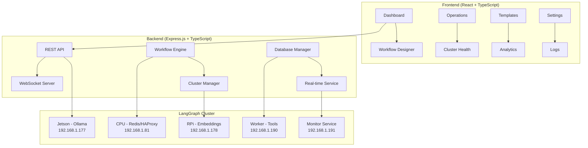

# LangGraph Orchestrator 🚀

A comprehensive web-based workflow orchestration platform for your LangGraph cluster. Transform your distributed AI infrastructure into an intuitive, visual workflow management system.

## 🎯 Overview

The LangGraph Orchestrator provides a complete web UI for managing and orchestrating complex AI workflows across your multi-node LangGraph cluster. It features real-time monitoring, visual workflow design, execution tracking, and comprehensive analytics.

### 🏗️ Architecture



## 🌟 Features

### 📊 **Dashboard Tab**
- **Real-time Cluster Overview**: Live status of all nodes and services
- **Workflow Activity**: Recent executions and success rates
- **Quick Actions**: Start/stop cluster, execute workflows
- **System Metrics**: Performance indicators and resource usage

### 🎨 **Workflow Designer Tab**
- **Visual Node Editor**: Drag-and-drop interface using React Flow
- **Node Types**:
  - 🧠 **LLM Nodes**: Jetson Ollama, CPU Llama.cpp
  - 🔍 **Embeddings Nodes**: Vector processing
  - 🛠️ **Tools Nodes**: Web search, file processing
  - 🔀 **Decision Nodes**: Conditional logic
  - 📊 **Data Nodes**: Transformation and storage
  - 📤 **Output Nodes**: Results formatting
- **Connection Management**: Visual edge connections with conditions
- **Configuration Panels**: Node-specific settings and parameters
- **Validation**: Real-time workflow validation and error checking

### ⚡ **Operations Tab**
- **Execution Dashboard**: Monitor running workflows
- **Progress Tracking**: Real-time execution progress with node-level details
- **Execution History**: Complete log of past runs
- **Results Viewer**: Output inspection and analysis
- **Error Handling**: Detailed error reports and debugging info
- **Cancellation**: Stop running workflows when needed

### 🏥 **Cluster Health Tab**
- **Node Status**: Real-time health of all cluster nodes
  - Jetson Orin Nano (192.168.1.177) - LLM Processing
  - CPU Coordinator (192.168.1.81) - Redis, HAProxy, Llama.cpp
  - RPi Embeddings (192.168.1.178) - Vector processing
  - Worker Tools (192.168.1.190) - Tool execution
  - Worker Monitor (192.168.1.191) - System monitoring
- **Service Monitoring**: Individual service health checks
- **Resource Metrics**: CPU, memory, disk usage per node
- **Network Status**: Connectivity and latency monitoring
- **Alerts**: Automated issue detection and notifications

### 📋 **Templates Tab**
- **Pre-built Workflows**: Ready-to-use templates based on the use cases:
  - 🔍 **Simple Research Assistant**: Query analysis → Web search → Content analysis
  - 📄 **Document Q&A System**: Document processing → Question answering
  - 🏢 **Competitive Analysis**: Competitor discovery → Research → Analysis
  - ✍️ **Content Creation Pipeline**: Research → Outline → Writing → Optimization
- **Template Categories**: Organized by complexity and use case
- **Customization**: Modify templates for specific needs
- **Import/Export**: Share templates across teams

### 📈 **Analytics Tab**
- **Performance Metrics**: Execution times, success rates, error analysis
- **Usage Statistics**: Most popular workflows and templates
- **Trend Analysis**: Historical performance data and insights
- **Resource Utilization**: Cluster efficiency and optimization suggestions
- **Custom Reports**: Configurable analytics dashboards
- **Data Export**: CSV/JSON export for external analysis

### ⚙️ **Settings Tab**
- **Cluster Configuration**: Node and service management
- **User Preferences**: Theme, notifications, dashboard layout
- **API Settings**: Endpoint configuration and authentication
- **Backup/Restore**: Workflow and configuration management
- **Integration Settings**: External tool connections

### 📝 **Logs Tab**
- **System Logs**: Real-time application and cluster logs
- **Workflow Logs**: Detailed execution traces
- **Error Logs**: Comprehensive error tracking and debugging
- **Performance Logs**: Resource usage and timing data
- **Log Filtering**: Search and filter by level, source, timestamp
- **Export Options**: Download logs for analysis

## 🚀 Quick Start

### Prerequisites

1. **LangGraph Cluster**: Ensure your cluster is running (see your cluster documentation)
2. **Node.js**: Version 18+ required
3. **Python**: Version 3.8+ for cluster integration

### Installation

```bash
# Navigate to the orchestrator directory
cd langgraph-orchestrator

# Run the setup script (automatically detects network configuration)
./setup.sh

# Configure network access for cluster nodes
./configure-network.sh

# Start development servers
npm run dev
```

This will start:
- Backend API server on `http://<your-ip>:3001` (accessible from all cluster nodes)
- Frontend development server on `http://<your-ip>:3000` (accessible from all cluster nodes)
- WebSocket server for real-time updates

### Network Access

The orchestrator is configured to be accessible from all nodes in your cluster:

- **From Jetson (192.168.1.177)**: http://192.168.1.81:3000
- **From RPi Embeddings (192.168.1.178)**: http://192.168.1.81:3000
- **From Worker Tools (192.168.1.190)**: http://192.168.1.81:3000
- **From Worker Monitor (192.168.1.191)**: http://192.168.1.81:3000
- **Local access**: http://localhost:3000

The setup script automatically:
- Detects your machine's IP address
- Configures CORS for cross-origin requests
- Sets up firewall rules (if needed)
- Binds servers to all network interfaces

### Production Setup

```bash
# Build for production
npm run build

# Start production server
npm start
```

## 🔧 Configuration

### Environment Variables

Create `.env` files in both backend and frontend directories:

**Backend (.env)**:
```env
NODE_ENV=production
PORT=3001
DATABASE_PATH=./data/orchestrator.db
CLUSTER_ORCHESTRATOR_PATH=/home/sanzad/ai-infrastructure/langgraph-config
```

**Frontend (.env)**:
```env
VITE_API_URL=http://localhost:3001
VITE_WS_URL=ws://localhost:3001
```

### Cluster Integration

The orchestrator automatically connects to your LangGraph cluster using the existing cluster orchestrator at:
```
/home/sanzad/ai-infrastructure/langgraph-config/cluster_orchestrator.py
```

Ensure this path is accessible and the cluster orchestrator is functional.

## 📋 API Documentation

### REST API Endpoints

#### Cluster Management
- `GET /api/cluster/status` - Get cluster status
- `POST /api/cluster/action` - Execute cluster actions (start/stop/restart)
- `GET /api/cluster/nodes` - Get node information
- `GET /api/cluster/services` - Get service status
- `GET /api/cluster/health` - Get health summary

#### Workflow Management
- `GET /api/workflows` - List all workflows
- `POST /api/workflows` - Create new workflow
- `GET /api/workflows/:id` - Get workflow by ID
- `PUT /api/workflows/:id` - Update workflow
- `DELETE /api/workflows/:id` - Delete workflow
- `POST /api/workflows/:id/execute` - Execute workflow
- `GET /api/workflows/:id/executions` - Get execution history

#### Templates
- `GET /api/workflows/templates/list` - Get workflow templates
- `POST /api/workflows/templates/:id/create` - Create from template

#### Analytics
- `GET /api/analytics/dashboard` - Dashboard analytics
- `GET /api/analytics/executions` - Execution analytics
- `GET /api/analytics/workflows` - Workflow analytics
- `GET /api/analytics/performance` - Performance metrics

### WebSocket Events

#### Client → Server
- `executeWorkflow` - Execute workflow
- `clusterAction` - Cluster management
- `subscribe` - Subscribe to topics
- `requestClusterStatus` - Request current status

#### Server → Client
- `clusterStatus` - Cluster status updates
- `workflowUpdate` - Workflow execution updates
- `nodeUpdate` - Node status changes
- `serviceUpdate` - Service status changes
- `alert` - System alerts

## 🛠️ Development

### Project Structure

```
langgraph-orchestrator/
├── backend/
│   ├── src/
│   │   ├── routes/          # API routes
│   │   ├── services/        # Business logic
│   │   ├── models/          # Data models
│   │   └── utils/           # Utilities
│   ├── package.json
│   └── tsconfig.json
├── frontend/
│   ├── src/
│   │   ├── components/      # React components
│   │   ├── pages/           # Page components
│   │   ├── hooks/           # Custom React hooks
│   │   ├── services/        # API services
│   │   ├── types/           # TypeScript types
│   │   └── utils/           # Utilities
│   ├── package.json
│   └── vite.config.ts
├── database/               # SQLite database files
├── docs/                  # Documentation
└── README.md
```

### Tech Stack

**Backend**:
- Express.js + TypeScript
- Socket.IO for real-time communication
- SQLite for data persistence
- Axios for HTTP requests
- Node-cron for scheduling

**Frontend**:
- React 18 + TypeScript
- Vite for development and building
- Tailwind CSS for styling
- React Flow for workflow visualization
- React Query for state management
- Socket.IO client for real-time updates
- Recharts for analytics visualization

### Adding New Features

1. **Backend Services**: Add to `backend/src/services/`
2. **API Routes**: Add to `backend/src/routes/`
3. **Frontend Components**: Add to `frontend/src/components/`
4. **Pages**: Add to `frontend/src/pages/`

## 📊 Workflow Templates

### Template Categories

#### **Simple Workflows** (2-3 services)
- **Research Assistant**: Query → Search → Analysis
- **Document Q&A**: Upload → Process → Question answering
- **Market Intelligence**: Search → Analysis → Report

#### **Medium Workflows** (Multi-step, adaptive)
- **Competitive Analysis**: Discovery → Research → Analysis → Insights
- **Content Creation**: Research → Outline → Writing → Optimization
- **Investment Due Diligence**: Research → Analysis → Risk Assessment

#### **Complex Workflows** (Full cluster orchestration)
- **Business Intelligence Platform**: Multi-agent monitoring and analysis
- **R&D Assistant**: Literature review → Development → Publication
- **Legal Research Platform**: Document analysis → Case law research → Report

### Template Structure

Each template includes:
- **Workflow Definition**: Nodes, edges, and configuration
- **Documentation**: Purpose, inputs, outputs, and usage
- **Examples**: Sample inputs and expected results
- **Customization Guide**: How to modify for specific needs

## 🔒 Security

### Authentication
- JWT-based authentication (configurable)
- Role-based access control
- API key management

### Data Protection
- Input validation and sanitization
- SQL injection prevention
- XSS protection
- CSRF tokens

### Network Security
- HTTPS enforcement in production
- CORS configuration
- Rate limiting
- Request validation

## 📈 Performance

### Optimization Features
- **Connection Pooling**: Efficient database connections
- **Caching**: Redis-based caching for frequent operations
- **Lazy Loading**: Component and data lazy loading
- **Code Splitting**: Optimized bundle sizes
- **Real-time Optimization**: Efficient WebSocket usage

### Monitoring
- **Application Metrics**: Response times, error rates
- **Resource Usage**: CPU, memory, disk utilization
- **Cluster Health**: Node and service monitoring
- **User Analytics**: Feature usage and performance

## 🤝 Contributing

### Development Workflow

1. **Setup Development Environment**:
   ```bash
   npm run install:all
   npm run dev
   ```

2. **Make Changes**:
   - Follow TypeScript and ESLint rules
   - Write tests for new features
   - Update documentation

3. **Testing**:
   ```bash
   npm run test
   npm run lint
   npm run build
   ```

4. **Submit Changes**:
   - Create feature branch
   - Submit pull request
   - Include tests and documentation

### Code Standards

- **TypeScript**: Strict mode enabled
- **ESLint**: Configured for React and Node.js
- **Prettier**: Automatic code formatting
- **Conventional Commits**: Structured commit messages

## 📚 Advanced Usage

### Custom Node Types

Create custom workflow nodes by extending the base node types:

```typescript
interface CustomNodeConfig {
  type: 'custom';
  config: {
    customParameter: string;
    customEndpoint: string;
  };
}
```

### Workflow Orchestration Patterns

1. **Sequential Execution**: Linear workflow processing
2. **Parallel Execution**: Concurrent node execution
3. **Conditional Branching**: Decision-based routing
4. **Loop Patterns**: Iterative processing
5. **Error Handling**: Fallback and retry logic

### Integration with External Systems

- **APIs**: REST and GraphQL integrations
- **Databases**: Multiple database connections
- **File Systems**: Local and cloud storage
- **Message Queues**: Redis, RabbitMQ support
- **Monitoring**: Prometheus, Grafana integration

## 🐛 Troubleshooting

### Common Issues

1. **Cluster Connection Failed**:
   - Check cluster orchestrator path
   - Verify SSH key authentication
   - Ensure all nodes are accessible

2. **WebSocket Connection Issues**:
   - Check firewall settings
   - Verify proxy configuration
   - Check Socket.IO compatibility

3. **Database Errors**:
   - Ensure SQLite permissions
   - Check disk space
   - Verify database schema

4. **Performance Issues**:
   - Monitor resource usage
   - Check network latency
   - Optimize workflow complexity

### Debug Mode

Enable debug logging:

```bash
DEBUG=langgraph:* npm run dev
```

### Support

- **Documentation**: See `/docs` directory
- **Issues**: GitHub issue tracker
- **Community**: Discussion forums
- **Enterprise**: Contact support team

## 🚀 Deployment

### Docker Deployment

```bash
# Build containers
docker-compose build

# Start services
docker-compose up -d

# Check status
docker-compose ps
```

### Kubernetes Deployment

```yaml
# See deployment/k8s/ for full configuration
apiVersion: apps/v1
kind: Deployment
metadata:
  name: langgraph-orchestrator
spec:
  replicas: 2
  selector:
    matchLabels:
      app: langgraph-orchestrator
  template:
    metadata:
      labels:
        app: langgraph-orchestrator
    spec:
      containers:
      - name: orchestrator
        image: langgraph-orchestrator:latest
        ports:
        - containerPort: 3001
```

### Production Checklist

- [ ] Environment variables configured
- [ ] Database backups enabled
- [ ] SSL certificates installed
- [ ] Monitoring configured
- [ ] Log aggregation setup
- [ ] Security scanning completed
- [ ] Performance testing passed
- [ ] Documentation updated

## 📄 License

MIT License - see LICENSE file for details.

## 🙏 Acknowledgments

Built with ❤️ for the LangGraph community. Special thanks to:
- React Flow team for the excellent workflow visualization
- Socket.IO for real-time communication
- Tailwind CSS for beautiful styling
- The open-source community for inspiration and tools

---

**Ready to orchestrate your AI workflows?** 🎵

Start with `./setup.sh && ./start-dev.sh` and visit `http://<your-ip>:3000` from any cluster node to begin building amazing AI workflows with your LangGraph cluster!
